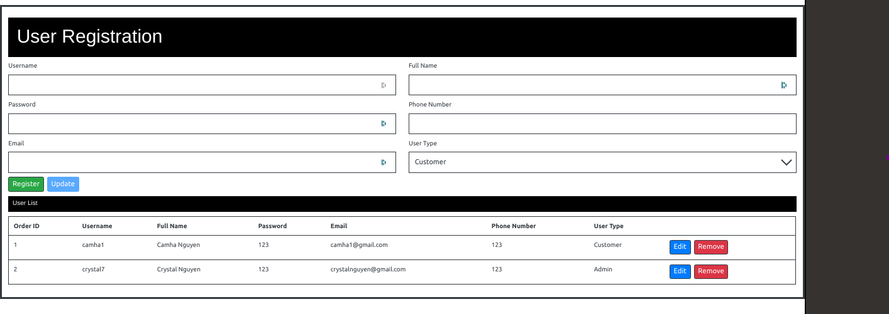

# Getting Started with Create React App

This project was bootstrapped with [Create React App](https://github.com/facebook/create-react-app).

## Project Description

This project is to manage different type of users. The user can register using user registration form. When successfully register there will be a sweet alert to let user know their profile. If any information is missing or error, there will be an alert to let user know.

## Available Scripts

In the project directory, you can run:

### `yarn start`

Runs the app in the development mode.\
Open [http://localhost:3000](http://localhost:3000) to view it in the browser.

## Project View

